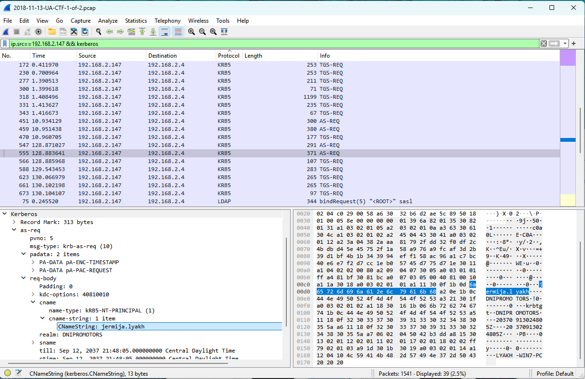
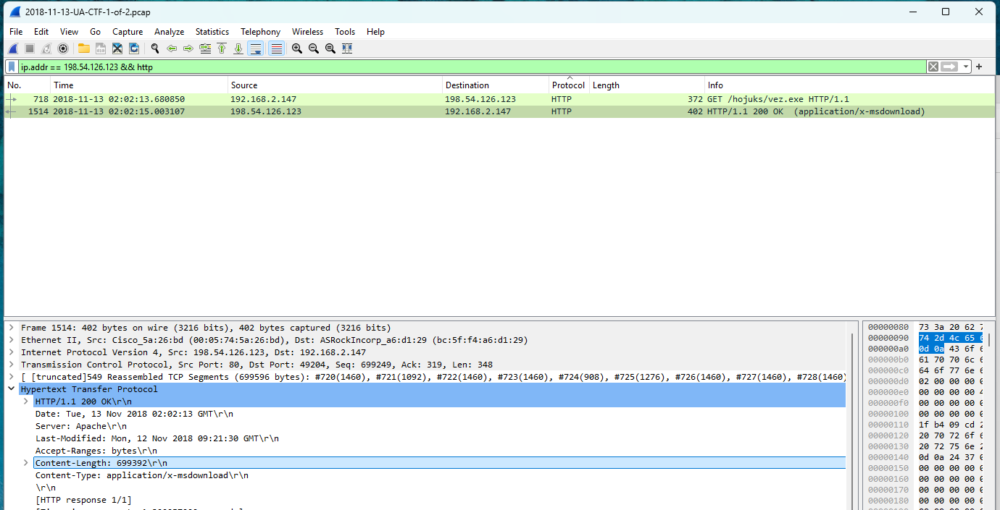

# Malware EXE Download Step-by-Step Guide

## Initial PCAP Load and Inspection  
Loaded the PCAP file into Wireshark to begin analysis.  
Observed traffic within the LAN and external HTTP communications.  

---

## Step 1: Identify Windows Client IP and MAC Address  
**Wireshark filter:**  
ip.src == 192.168.2.147

Verified source MAC address from Ethernet II header:  
`ASRockIncorp_a6:d1:29 (bc:5f:f4:a6:d1:29)`  


---

## Step 2: Determine Hostname via NetBIOS and DNS Queries  
**Wireshark filter:**  
ip.addr == 192.168.2.147 && (nbns || dns)

Found hostname:  
`LYAKH-WIN7-PC`  


---

## Step 3: Extract Windows User Account from Kerberos Traffic  
**Wireshark filter:**  
ip.src == 192.168.2.147 && kerberos

Located Kerberos `cname-string` field revealing user account:  
`jermija.lyakh`  



---

## Step 4: Identify Malicious Executable Download via HTTP  
**Wireshark filter:**  
http.request.uri contains ".exe"

Found HTTP GET request for executable:  
`GET /hojuks/vez.exe HTTP/1.1`  
Destination IP: `198.54.126.123`  


---

## Step 5: Note Timestamp of Executable Request  
Inspect frame details for request timestamp (UTC):  
`2018-11-13 02:02:13.680850`  


---

## Step 6: Verify HTTP Response and Content Length  
**Wireshark filter:**  
ip.addr == 198.54.126.123 && http

Found HTTP 200 OK response with `Content-Length: 699392` bytes  



---

## Step 7: Extract and Verify Malicious Executable File  
Exported the executable file from the HTTP response using Wireshark’s **File → Export Objects → HTTP** feature.  

  


Calculated SHA256 hash using PowerShell command:  
```powershell
Get-FileHash "path\to\vez.exe" -Algorithm SHA256

Resulting hash:
43092b2993c9d9cfab01aa340bc378cad547ae0938c6803cb580271139798765

!(08-sha256-hash-calculation.png)

Verified hash with VirusTotal confirming Trojan malware.


