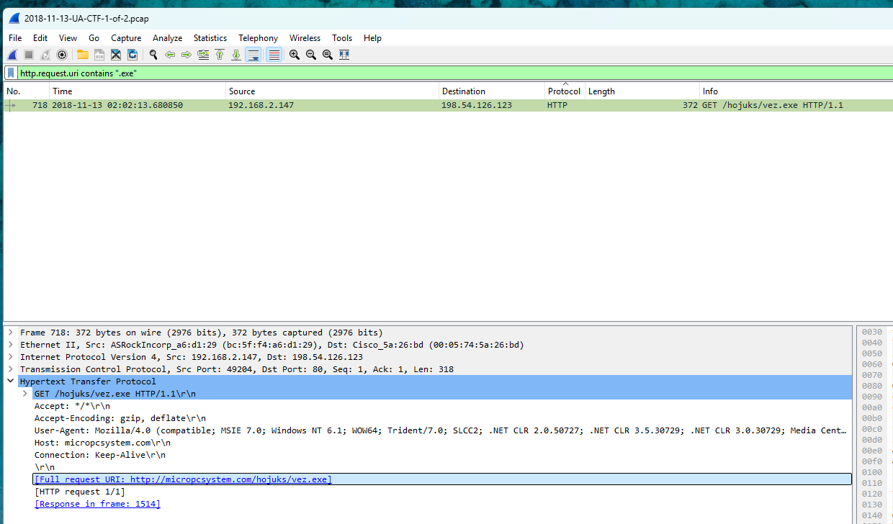
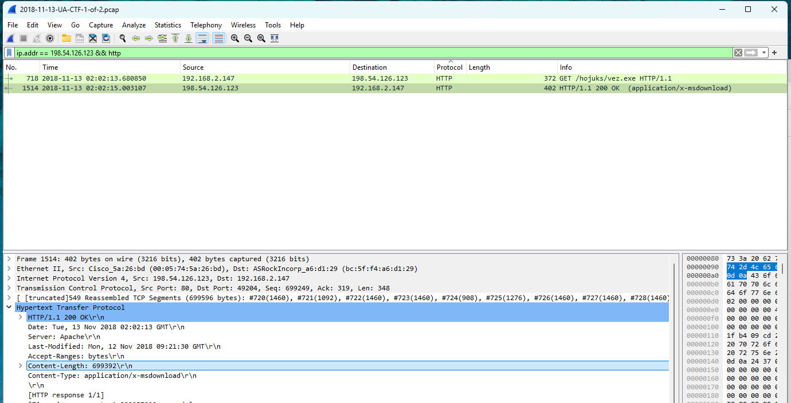

# Wireshark Traffic Analysis: Malware EXE Download

## Case Overview

This report analyzes a PCAP capturing a direct malware download via HTTP, originating from a Windows host making an outbound request to a suspicious domain. The malicious payload was a Windows PE executable served over port 80.

PCAP Source: [malware-traffic-analysis.net – 2018/11/13](https://www.malware-traffic-analysis.net/2018/11/13/index.html)

---

## Timeline of Events

| Step | Description |
|------|-------------|
| 1 | Infected host (`192.168.2.147`) initiates a TCP connection to `198.54.126.123` (micropcsystem[.]com) on port 80 |
| 2 | Host sends an HTTP GET request for `/hojuks/vez.exe` |
| 3 | Server responds with HTTP 200 OK and delivers a 699 KB executable |
| 4 | No other significant C2 traffic or follow-up infection behavior observed within capture timeframe |
| 5 | A secondary IP (`93.87.38.24`) appears toward the end of the capture, possibly indicating post-infection behavior |

---

## Detailed Findings

### Stage 1 – Malware Download Request

At frame **718**, the infected host initiates the download by sending an HTTP GET request:

GET /hojuks/vez.exe HTTP/1.1
Host: micropcsystem.com
User-Agent: Mozilla/4.0 (compatible; MSIE 7.0; Windows NT 6.1; Trident/4.0; SLCC2; .NET CLR 2.0.50727; .NET CLR 3.5.30729; .NET CLR 3.0.30729; Media Center PC 6.0; InfoPath.3)

- **Destination IP**: `198.54.126.123`  
- **Port**: `80`

### Stage 2 – Payload Delivery

At frame 1514, the server responds with a 200 OK and delivers a 683 KB .exe file with content type:

Content-Type: application/x-msdownload
Content-Length: 699392

### Stage 3 – Suspicious Secondary IP Activity

Toward the end of the capture, a **new IP address** appears that was not part of the initial malware download sequence:

- **IP**: `93.87.38.24`
- **Observed Behavior**: The infected host (`192.168.2.147`) communicates with this IP after retrieving the malware. This may suggest **post-infection behavior**, such as a callback, command-and-control communication, or further payload delivery.

## Indicators of Compromise (IOCs)

| Type             | Value                                     |
| ---------------- | ----------------------------------------- |
| Victim IP        | `192.168.2.147`                           |
| Malware URL      | `http://micropcsystem[.]com/hojuks/vez.exe` |
| Server IP        | `198.54.126.123`                          |
| Post-download IP | `93.87.38.24`                             |
| File size        | `699392 bytes`                            |
| File type        | `application/x-msdownload`                |

## Threat Analysis Summary

- The infected Windows host successfully downloaded an executable file over HTTP from a remote server.
- While no command and control traffic was immediately observed, later connections suggest delayed activation or callback routines.
- This represents a typical example of a direct malware delivery method via insecure web traffic.
